StarGAN によって声質変換を試みる。

[前回の実験]({{ '/experiments/47c97768.html' | absolute_url}})の結果を踏まえ、Generator モデルの ResBlock で横長のフィルタを使うことにした。

また、ただフィルタを横に広げるだけでは VRAM 不足に陥ってしまったため、Downsampling/Upsampling を一段深くすることにした。

入力データ、Discriminator モデル、学習方法は [前回の実験]({{ '/experiments/47c97768.html' | absolute_url}}) と同じになっている。

## モデル ##

Discriminator モデルは [前回の実験]({{ '/experiments/47c97768.html' | absolute_url}}#discriminator-のモデル) と同じ。

### Generator のモデル ###

[前回の実験]({{ '/experiments/47c97768.html' | absolute_url}}#generator-のモデル) と異なる点は以下。

*   Downsamling part、Upsampling part が一段深い。

*   Bottleneck part の層が増えた。

*   Bottleneck part のフィルタが横長になった。

```mermaid
graph TD

subgraph Input
    input-spectrogram("&laquo;Input&raquo;<br/>Spectrogram<br/>1 x 256 x 256<br/>[0, 1]")
    input-labels("&laquo;Input&raquo;<br/>Labels<sub>input</sub><br/>1479<br/>{0, 1}")
end

subgraph Downsampling
    downsamp1[Convoluton<br/>n: 32, k: 7, stride: 1, pad: 3<br/>BatchNormalization<br/>ReLU]
    downsamp2[Convoluton<br/>n: 64, k: 4, stride: 2, pad: 1<br/>BatchNormalization<br/>ReLU]
    downsamp3[Convoluton<br/>n: 128, k: 4, stride: 2, pad: 1<br/>BatchNormalization<br/>ReLU]
    downsamp4[Convoluton<br/>n: 256, k: 4, stride: 2, pad: 1<br/>BatchNormalization<br/>ReLU]
end

repeat((repeat<br/>32 x 32))
concat((concat))
merge[Convolution<br/>n: 256, k: 3x5, stride: 1, pad: 1x2<br/>BatchNormalization<br/>ReLU]

subgraph Bottleneck
    bottleneck1[ResBlock<br/>n: 256, k: 3x5, stride: 1, pad: 1x2<br/>BatchNormalization<br/>ReLU]
    bottleneck2[ResBlock<br/>n: 256, k: 3x5, stride: 1, pad: 1x2<br/>BatchNormalization<br/>ReLU]
    bottleneck3[ResBlock<br/>n: 256, k: 3x5, stride: 1, pad: 1x2<br/>BatchNormalization<br/>ReLU]
    bottleneck4[ResBlock<br/>n: 256, k: 3x5, stride: 1, pad: 1x2<br/>BatchNormalization<br/>ReLU]
    bottleneck5[ResBlock<br/>n: 256, k: 3x5, stride: 1, pad: 1x2<br/>BatchNormalization<br/>ReLU]
    bottleneck6[ResBlock<br/>n: 256, k: 3x5, stride: 1, pad: 1x2<br/>BatchNormalization<br/>ReLU]
end

subgraph Upsampling
    upsamp1[Deconvolution<br/>n: 128, k: 4, stride: 2, pad: 1<br/>BatchNormalization<br/>ReLU]
    upsamp2[Deconvolution<br/>n: 64, k: 4, stride: 2, pad: 1<br/>BatchNormalization<br/>ReLU]
    upsamp3[Deconvolution<br/>n: 32, k: 4, stride: 2, pad: 1<br/>BatchNormalization<br/>ReLU]
    upsamp4[Deconvolution<br/>n: 1, k: 7, stride: 1, pad: 3<br/>sigmoid]
end

output("&laquo;Output&raquo;<br/>Spectrogram<br/>1 x 256 x 256<br/>(0, 1)")

input-spectrogram --> downsamp1
downsamp1 --> | 32 x 256 x 256 | downsamp2
downsamp2 --> | 64 x 128 x 128 | downsamp3
downsamp3 --> | 128 x 64 x 64 | downsamp4
downsamp4 --> | 256 x 32 x 32 | concat

input-labels --> repeat
repeat --> | 1479 x 32 x 32 | concat
concat --> | 1735 x 32 x 32 | merge

merge --> | 256 x 32 x 32 | bottleneck1
bottleneck1 --> | 256 x 32 x 32 | bottleneck2
bottleneck2 --> | 256 x 32 x 32 | bottleneck3
bottleneck3 --> | 256 x 32 x 32 | bottleneck4
bottleneck4 --> | 256 x 32 x 32 | bottleneck5
bottleneck5 --> | 256 x 32 x 32 | bottleneck6
bottleneck6 --> | 256 x 32 x 32 | upsamp1

upsamp1 --> | 128 x 64 x 64 | upsamp2
upsamp2 --> | 64 x 128 x 128 | upsamp3
upsamp3 --> | 32 x 256 x 256 | upsamp4
upsamp4 --> output
```

{:title="Generator Model" data-style="details"}

## 学習パラメータ ##

optimizer: RMSprop

learning rate: 1e-5

minibatch size: 2

epoch: 1000

## 結果 ##

学習時間: 25.06 時間

<audio controls data-gdrive="1C-doHjR-Xxib-X_5Hy5-UsJ5iEO5GfOa" type="audio/wav"></audio>

## 感想 ##

人の話し声のような音声が出力されたが、言語情報が維持できていない。前半が無音になっていることを除けばアクセント位置は維持しているように感じる。