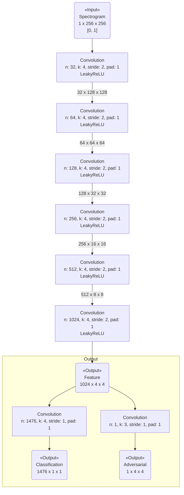
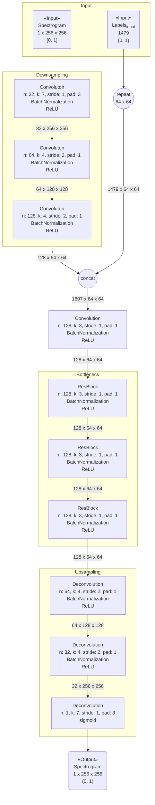
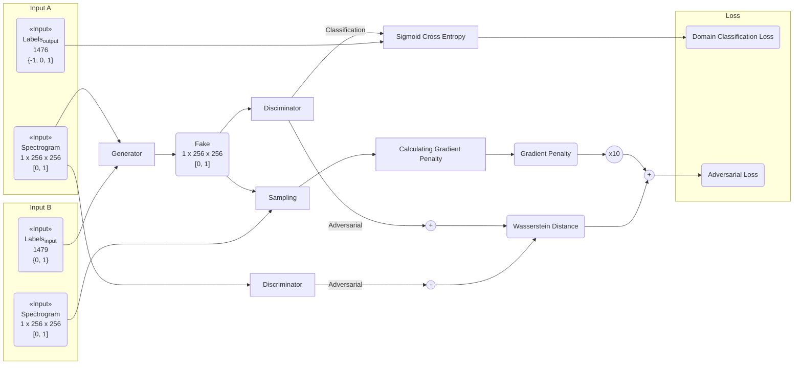
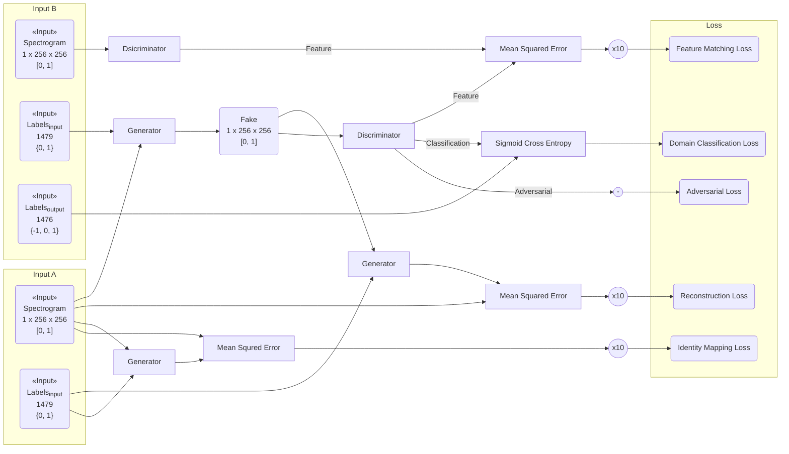

StarGAN によって声質変換を試みる。

[StarGAN 論文](http://arxiv.org/abs/1711.09020) に近い形での実装をしたかったが、GPU で学習しようとした際に VRAM 不足により落ちてしまった。
そこで、VRAM 内に収めるためにネットワークを縮小した。これにより表現空間が小さくなりすぎている可能性がある。

## 入力データ ##

スペクトログラム（音声データ）とラベル（教師データ）の二種類を扱う。

### スペクトログラム ###

以下の手順で生成する。

1.  16000Hz/1ch にリサンプリングする。

2.  任意の 66304 サンプルを抽出し、[-1, 1] の範囲に収まるように正規化する。

    *   このとき、RMS が 0.5 を超える場合はサンプルを破棄する。（無音）

3.  512 サンプルずつ重なるように、1024 サンプルで切り、hamming 窓を掛ける。

    *   1024x256 のデータが得られる。

4.  FFT を掛け、パワースペクトルを得る。データ長（1024）で割ることで、[0, 1] の範囲に収まるようになる。

5.  各パワースペクトルの 2 番目の値から、256 個のデータを使用する。

    *   1 番目の値は直流成分のため使用しない。

    *   スペクトルは 512 番目を境に対象になっている。左から 256 のデータを使うことで、8000 Hz で LPF を掛けたことと同じ効果が得られる。

    *   この時点で 256x256 のスペクトログラムになっている。

6.  対数スケールにしてから [0, 1] に正規化する。

    1.  10-3 未満の値をすべて 10-3 にする。

    2.  対数をとる。

    3.  loge10-3 を引いて、 -loge10-3 で割る。これによって [0, 1] に正規化される。

### ラベル ###

ラベルは以下の3グループ。

*   発話者 ID — 1421 クラス

*   発話者の生まれた地域 — 53 クラス

*   発話者の性別 — 2 クラス

全てのグループについてラベリングされているとは限らない。

#### 入力ラベル ####

3グループすべての one-hot vector を concat して、更にラベリングされているグループに 1 が立っている vector を concat する。

最終的なサイズは 1421 + 53 + 2 + 3 = 1479。値は {0, 1}。

#### 出力ラベル ####

3グループ全ての one-hot vector を concat する。ただし、ラベリングされていないグループはすべて値を -1 とし、学習の際に -1 だった場合は無視することにする。

最終的なサイズは 1421 + 53 + 2 = 1476。値は {-1, 0, 1}。

## モデル ##

VRAM のサイズのため、論文の実装とは多少異なる。

### Discriminator のモデル ###

論文の実装と異なる点は以下。

*   フィルタの数が全体として半分になっている。

{:title="Discriminator Model" data-style="details"}

### Generator のモデル ###

論文の実装と異なる点は以下。

*   フィルタの数が全体として半分になっている。

*   Bottleneck part の数が半分になっている。

*   ラベルを入力に concat するのではなく、 Bottleneck part の直前で concat している。

    *   フィルタの数の辻褄を合わせるため、Bottleneck part の直前に Convolution Layer が挿入してある。

{:title="Generator Model" data-style="details"}

## 学習 ##

Discriminator の学習を 5 回、Generator の学習を 1 回行い、それを 1 iteration とする。

### Discriminator の学習 ###

論文の実装とほぼ同じで、Conditional GAN + WGAN-gp といった感じ。

{:title="Discriminator Training" data-style="details"}

### Generator の学習 ###

論文で使用している loss に加えて、StarGAN でいうところの Identity Mapping Loss を導入した。StarGAN では、明度反転画像を生成するような学習をしてしまうケースが報告されており、それを回避できるのではないかと考えた。

更に、Feature Matching Loss も導入しているが、なぜ導入したかは不明。

{:title="Generator Training" data-style="details"}

## 学習パラメータ ##

optimizer: RMSprop

learning rate: 1e-5

minibatch size: 2

epoch: 203

## 結果 ##

学習時間: 4.32 時間

ラベルの入力を問わず、ほぼ入力スペクトログラムと同じ出力を得るようになった。

### 学習曲線 ###

## 感想 ##

冷静に考えればわかることだが、この Generator モデルでは、ラベルとマージした直後から考えると、横 256px のうち左右 62px 分しか影響しない。このため、想像のような出力が得られたかったのだと考える。