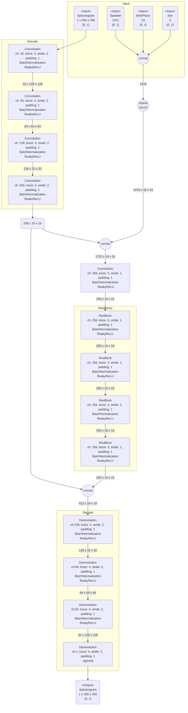
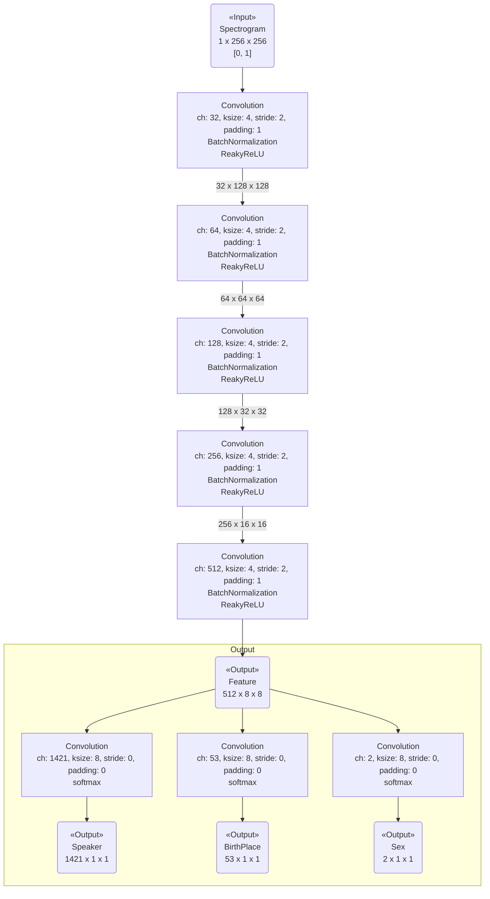

StarGAN もどきによる声質変換。

## モデル ##

{:title="Generator" data-style="details"}

{:title="Discriminator" data-style="details"}

## 学習 ##

### Discriminator ###

（たぶん）普通のStarGAN。

CGAN + WGAN-gp みたいな感じ。

### Generator ###

（たぶん）普通のStarGAN + feature matching loss + identity mapping loss。

identity mapping loss は、StarGANで明度が反転したような画像を生成するように学習してしまうケースが報告されていたため。

feature matcing loss はなんとなく。

### パラメータ ###

optimizer: RMSprop

learning rate: 1e-5

minibatch size: 5

epoch: 1000

## 結果 ##

[1000epoch 時点での出力](https://drive.google.com/open?id=1B2PIzrxNX0E_ikUOWawAvHBUuktqyOXV)

### 学習曲線 ###

## 感想 ##

出力はなんとなく女性の話し声のように聞こえないこともないが、入力の言語情報が維持できていない。これは、Generator のモデルの大きさか、学習方法に問題があると推測できる。

Discriminator は、話者分類の精度がかなり低い。これは、Discriminator のモデルの大きさに問題があると推測できる。

以上から、次回以降の目標を次のように定める。

1.  話者を分類できるだけの空間をもった Discriminator を作る

    通常の分類器として学習させ、そのモデルが要件を満たすことを確かめる。

2.  言語情報を維持できる Generator を作る

    AutoEncoder として学習させ、そのモデルが要件を満たすことを確かめる。