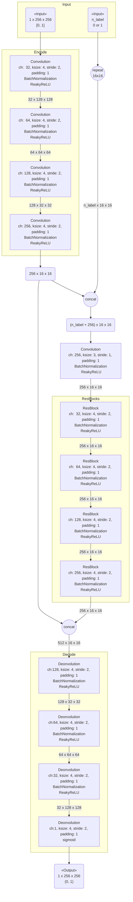

StarGAN もどきによる声質変換。

```mermaid
graph TD

subgraph Input
    input-spectrogram("&laquo;Input&raquo;<br/>1 x 256 x 256<br/>[0, 1]")
    input-labels("&laquo;Input&raquo;<br/>n_label<br />0 or 1")
end

subgraph Encode
    conv1[Convolution<br/>ch:  32, ksize: 4, stride: 2, padding: 1<br/>BatchNormalization<br/>ReakyReLU]
    conv2[Convolution<br/>ch:  64, ksize: 4, stride: 2, padding: 1<br/>BatchNormalization<br/>ReakyReLU]
    conv3[Convolution<br/>ch: 128, ksize: 4, stride: 2, padding: 1<br/>BatchNormalization<br/>ReakyReLU]
    conv4[Convolution<br/>ch: 256, ksize: 4, stride: 2, padding: 1<br/>BatchNormalization<br/>ReakyReLU]
end

conv4-out(256 x 16 x 16)
repeat((repeat<br/>16x16))
concat1((concat))
concat1-out("(n_label + 256) x 16 x 16")

merge[Convolution<br/>ch: 256, ksize: 3, stride: 1, padding: 1<br/>BatchNormalization<br/> ReakyReLU]

subgraph ResBlocks
    res1[ResBlock<br/>ch:  32, ksize: 4, stride: 2, padding: 1<br/>BatchNormalization<br/>ReakyReLU]
    res2[ResBlock<br/>ch:  64, ksize: 4, stride: 2, padding: 1<br/>BatchNormalization<br/>ReakyReLU]
    res3[ResBlock<br/>ch: 128, ksize: 4, stride: 2, padding: 1<br/>BatchNormalization<br/>ReakyReLU]
    res4[ResBlock<br/>ch: 256, ksize: 4, stride: 2, padding: 1<br/>BatchNormalization<br/>ReakyReLU]
end

concat2((concat))

subgraph Decode
    dconv1[Deonvolution<br/>ch:128, ksize: 4, stride: 2, padding: 1<br/>BatchNormalization<br/>ReakyReLU]
    dconv2[Deonvolution<br/>ch:64, ksize: 4, stride: 2, padding: 1<br/>BatchNormalization<br/>ReakyReLU]
    dconv3[Deonvolution<br/>ch:32, ksize: 4, stride: 2, padding: 1<br/>BatchNormalization<br/>ReakyReLU]
    dconv4[Deonvolution<br/>ch:1, ksize: 4, stride: 2, padding: 1<br/>sigmoid]
end

output("&laquo;Output&raquo;<br/>1 x 256 x 256<br/>(0, 1)")

input-spectrogram --> conv1
conv1 --> | 32 x 128 x 128 | conv2
conv2 --> | 64 x 64 x 64 | conv3
conv3 --> | 128 x 32 x 32 | conv4
conv4 --> conv4-out
conv4-out --> concat1
input-labels --> repeat
repeat --> | n_label x 16 x 16 | concat1
concat1 --> concat1-out
concat1-out --> merge
merge --> | 256 x 16 x 16 | res1
res1 --> | 256 x 16 x 16 | res2
res2 --> | 256 x 16 x 16 | res3
res3 --> | 256 x 16 x 16 | res4

res4 --> | 256 x 16 x 16 | concat2
conv4-out --> concat2
concat2 --> | 512 x 16 x 16 | dconv1
dconv1 --> | 128 x 32 x 32 | dconv2
dconv2 --> | 64 x 64 x 64 | dconv3
dconv3 --> | 32 x 128 x 128 | dconv4
dconv4 --> output
```
{:title="Generator"}
