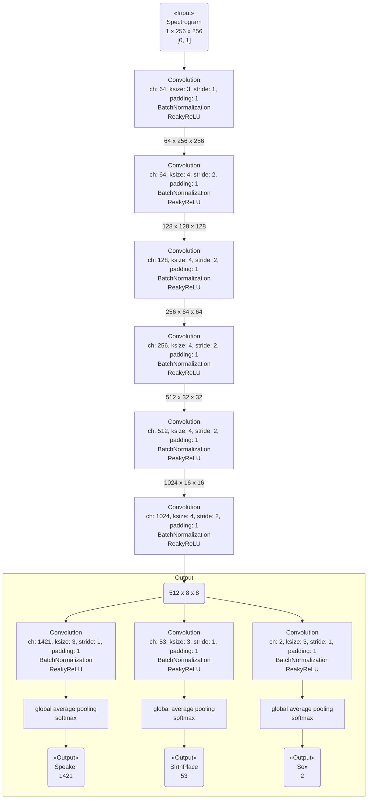

StarGAN (Conditional GAN) の実装にあたって、Discriminator にクラス分類できるだけの表現力があることを予め示したい。

[以前の実験]({{ '/experiments/54314b33.html' | absolute_url }})では、話者を分類する能力が著しく低かったため、それを改善することが目標になる。

## モデル ##

{:title="Model" data-style="details"}

## 入力 ##

### スペクトログラム ###

16000 Hz の モノラル音声を、1024 サンプルを 512 サンプルずつ重なるように 256 サンプリングする。
その後、hamming 窓を掛け、FFT して結果の絶対値を得て、freq=0 を除いた 256 を使用する。（8000 Hz で LP フィルタをかけたのと同じ働きをする。）

### ラベル ###

発話者（1421クラス）、発話者の生まれた地域（53クラス）、性別（2クラス）の三種類。

すべてのデータが、完全にラベルが振られているとは限らない。

## 学習 ##

optimizer: RMSprop

learning rate: 1e-5

minibatch size: 10

epoch: 1000

## 結果 ## 

学習時間: 15.96 時間

話者分類の精度は 0.4 程度まで改善できた。このまま引き続き 1000 epoch ほど学習すれば 0.5 程度まではたどり着けると推測できる。

## 感想 ## 

もう少し精度のあるネットワークがほしい。

次回は StarGAN の論文の Discriminator に準じた形のネットワークを確認する。
