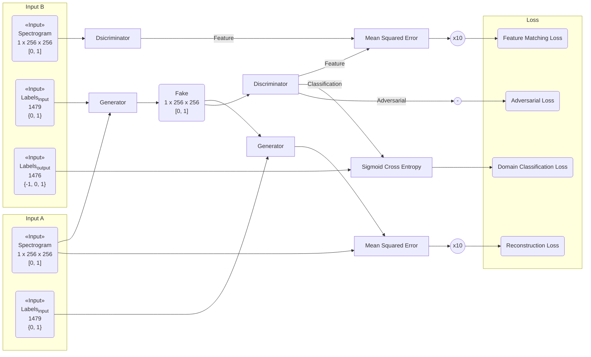

StarGAN によって声質変換を試みる。

これまでの実験では、CycleGAN に倣って Identity Mapping Loss が導入されていたが、これがどのように働いているか不明なため、いちど取り除いて実験する。

入力データ等は[以前の実験]({{ '/experiments/47c97768.html' | absolute_url }})と同じ。

## モデル ##

### Discriminator のモデル ###

[以前の実験]({{ '/experiments/47c97768.html#discriminator-のモデル' | absolute_url }})と同じ。

### Generator のモデル ###

```mermaid
graph TD

subgraph Input
    input-spectrogram("&laquo;Input&raquo;<br/>Spectrogram<br/>1 x 256 x 256<br/>[0, 1]")
    input-labels("&laquo;Input&raquo;<br/>Labels<sub>input</sub><br/>1479<br/>{0, 1}")
end

subgraph Downsampling
    downsamp1[Convoluton<br/>n: 32, k: 7, stride: 1, pad: 3<br/>BatchNormalization<br/>ReLU]
    downsamp2[Convoluton<br/>n: 64, k: 4, stride: 2, pad: 1<br/>BatchNormalization<br/>ReLU]
    downsamp3[Convoluton<br/>n: 128, k: 4, stride: 2, pad: 1<br/>BatchNormalization<br/>ReLU]
    downsamp4[Convoluton<br/>n: 256, k: 4, stride: 2, pad: 1<br/>BatchNormalization<br/>ReLU]
end

repeat((repeat<br/>32 x 32))
concat((concat))
merge[Convolution<br/>n: 256, k: 3, stride: 1, pad: 1<br/>BatchNormalization<br/>ReLU]

subgraph Bottleneck
    bottleneck1[ResBlock<br/>n: 256, k: 3, stride: 1, pad: 1<br/>BatchNormalization<br/>ReLU]
    bottleneck2[ResBlock<br/>n: 256, k: 3, stride: 1, pad: 1<br/>BatchNormalization<br/>ReLU]
    bottleneck3[ResBlock<br/>n: 256, k: 3, stride: 1, pad: 1<br/>BatchNormalization<br/>ReLU]
    bottleneck4[ResBlock<br/>n: 256, k: 3, stride: 1, pad: 1<br/>BatchNormalization<br/>ReLU]
    bottleneck5[ResBlock<br/>n: 256, k: 3, stride: 1, pad: 1<br/>BatchNormalization<br/>ReLU]
    bottleneck6[ResBlock<br/>n: 256, k: 3, stride: 1, pad: 1<br/>BatchNormalization<br/>ReLU]
end

subgraph Upsampling
    upsamp1[Deconvolution<br/>n:128, k: 4, stride: 2, pad: 1<br/>BatchNormalization<br/>ReLU]
    upsamp2[Deconvolution<br/>n: 64, k: 4, stride: 2, pad: 1<br/>BatchNormalization<br/>ReLU]
    upsamp3[Deconvolution<br/>n: 32, k: 4, stride: 2, pad: 1<br/>BatchNormalization<br/>ReLU]
    upsamp4[Deconvolution<br/>n: 1, k: 7, stride: 1, pad: 3<br/>sigmoid]
end

output("&laquo;Output&raquo;<br/>Spectrogram<br/>1 x 256 x 256<br/>(0, 1)")

input-spectrogram --> downsamp1
downsamp1 --> | 32 x 256 x 256 | downsamp2
downsamp2 --> | 64 x 128 x 128 | downsamp3
downsamp3 --> | 128 x 64 x 64 | downsamp4
downsamp4 --> | 256 x 32 x 32 | concat

input-labels --> repeat
repeat --> | 1479 x 32 x 32 | concat
concat --> | 1735 x 32 x 32 | merge

merge --> | 256 x 32 x 32 | bottleneck1
bottleneck1 --> | 256 x 32 x 32 | bottleneck2
bottleneck2 --> | 256 x 32 x 32 | bottleneck3
bottleneck3 --> | 256 x 32 x 32 | bottleneck4
bottleneck4 --> | 256 x 32 x 32 | bottleneck5
bottleneck5 --> | 256 x 32 x 32 | bottleneck6

bottleneck6 --> | 256 x 32 x 32 | upsamp1
upsamp1 --> | 128 x 32 x 32 | upsamp2
upsamp2 --> | 64 x 64 x 64 | upsamp3
upsamp3 --> | 32 x 128 x 128 | upsamp4
upsamp4 --> output
```

{:title="Generator Model" data-style="details"}

## 学習 ##

Discriminator の学習を 5 回、Generator の学習を 1 回行い、それを 1 iteration とする。

### Discriminator の学習 ###

[以前の実験]({{ '/experiments/47c97768.html#discriminator-の学習' | absolute_url }})と同じ。

### Generator の学習 ###

Identity Mapping Loss を削除。

{:title="Generator Training" data-style="details"}

## 学習パラメータ ##

*   optimizer: RMSprop

*   learning rate: 1e-5

    *   100 epoch 毎に 10-0.5 倍。

*   minibatch size: 2

*   epoch: 1000

## 結果 ##

学習時間: 22.68 時間

ラベルの入力を問わず、ほぼ入力スペクトログラムと同じ出力を得るようになった。

## 感想 ##

よくわかんない。