[前回の実験]({{ '/experiments/c9335bce.html' | absolute_url }})で、周波数方向に全結合しようとしていたが、勘違いのため全結合できていなかった。

今回は、全結合を含めたモデルに変更し、潜在変数を時間方向に16、周波数方向に4096要素のベクトルとして得る。

## モデル ##

```mermaid
graph TD

input("&laquo;Input&raquo;<br/>Spectrogram<br/>1 x 32 x 256<br/>[0, ∞)")

enc1[Convolution<br/>ch: 32, ksize: 7, stride: 1, padding: 3<br/>ReakyLeRU<br/>BatchNormalization]
enc2[Convolution<br/>ch: 64, ksize: 4, stride: 2, padding: 1<br/>ReakyLeRU<br/>BatchNormalization]
enc3[Convolution<br/>ch: 64, ksize: 1x4, stride: 1x2, padding: 0x1<br/>ReakyLeRU<br/>BatchNormalization]
enc4[Convolution<br/>ch: 64, ksize: 1x4, stride: 1x2, padding: 0x1<br/>ReakyLeRU<br/>BatchNormalization]
enc5[Convolution<br/>ch: 64, ksize: 1x4, stride: 1x2, padding: 0x1<br/>ReakyLeRU<br/>BatchNormalization]
enc6[Convolution<br/>ch: 1024, ksize: 1x9, stride: 1, padding: 0<br/>ReakyLeRU<br/>BatchNormalization]
enc7[Convolution<br/>ch: 4096, ksize: 1x8, stride: 1, padding: 0<br/>ReakyLeRU<br/>BatchNormalization]
enc8[Convolution<br/>ch: 4096, ksize: 1, stride: 1, padding: 0<br/>tanh<br/>BatchNormalization]

latent("Latent Variable<br/>4096 x 16 x 1<br/>(-1, 1)")

dec8[Convolution<br/>ch: 4096, ksize: 1, stride: 1, padding: 0<br/>ReakyLeRU<br/>BatchNormalization]
dec7[Deconvolution<br/>ch: 1024, ksize: 1x8, stride: 1, padding: 0<br/>ReakyLeRU<br/>BatchNormalization]
dec6[Deconvolution<br/>ch: 64, ksize: 1x9, stride: 1, padding: 0<br/>ReakyLeRU<br/>BatchNormalization]
dec5[Deconvolution<br/>ch: 64, ksize: 1x4, stride: 1x2, padding: 0x1<br/>ReakyLeRU<br/>BatchNormalization]
dec4[Deconvolution<br/>ch: 64, ksize: 1x4, stride: 1x2, padding: 0x1<br/>ReakyLeRU<br/>BatchNormalization]
dec3[Deconvolution<br/>ch: 64, ksize: 1x4, stride: 1x2, padding: 0x1<br/>ReakyLeRU<br/>BatchNormalization]
dec2[Deconvolution<br/>ch: 32, ksize: 4, stride: 2, padding: 1<br/>ReakyLeRU<br/>BatchNormalization]
dec1[Convolution<br/>ch: 1, ksize: 7, stride: 1, padding: 3<br/>softplus]

output("&laquo;Output&raquo;<br/>Spectrogram<br/>1 x 32 x 256<br/>(0, ∞)")

input --> enc1
enc1 --> | 32 x 32 x 256 | enc2
enc2 --> | 64 x 16 x 128 | enc3
enc3 --> | 64 x 16 x 64 | enc4
enc4 --> | 64 x 16 x 32 | enc5
enc5 --> | 64 x 16 x 16 | enc6
enc6 --> | 1024 x 16 x 8 | enc7
enc7 --> | 1024 x 16 x 1 | enc8
enc8 --> latent
latent --> dec8
dec8 --> | 4096 x 16 x 1 | dec7
dec7 --> | 1024 x 16 x 8 | dec6
dec6 --> | 64 x 16 x 16 | dec5
dec5 --> | 64 x 16 x 32 | dec4
dec4 --> | 64 x 16 x 64 | dec3
dec3 --> | 64 x 16 x 128 | dec2
dec2 --> | 64 x 32 x 256 | dec1
dec1 --> output
```

{:title="AutoEncoder Model" data-style="details"}

## 学習パラメータ ##

*   optimizer: RMSprop

*   learning rate: 1e-5

*   minibatch size: 50

*   epoch: 200

### 環境 ###

*   VRAM size: 3017MiB

## 結果 ##

学習時間: 1.52 時間

最終的な loss:

*   mean squared error: 0.0205

### 学習曲線 ###

### スペクトログラム ###

*   入力

    *   

*   出力

    *   

### 音声 ###

*   入力

    *   <audio controls src="" type="audio/wav"></audio>

*   出力

    *   <audio controls src="" type="audio/wav"></audio>

## 感想 ##

だいたい目標は達成できたように感じる。

層が増えたからか、[前回の実験]({{ '/experiments/c9335bce.html' | absolute_url }})よりも数値上の誤差は小さい（聴覚上の違いはよくわからない）。

潜在変数が 4096x16になっているのは少しサイズが大きい感じもする。
