声質変換のための AutoEncoder を実装する。

方針としては、以下の通り。

*   周波数方向への全結合を含む

*   時間に沿った複数の潜在変数を得る。

## 入力 ##

入力スペクトログラムは、以下の手順で生成する。

1.  16000Hz, 1ch にリサンプリングする。

2.  任意の1689サンプル（約1秒間）を抽出し、[-1, 1] の範囲に収まるように正規化する。

    *   正規化前のデータの、最小値と最大値の差が0（直流信号）の場合は、無音としてサンプルを破棄する。

    *   正規化後データの、RMS が0.5を超える場合は、無音としてサンプルを破棄する。

3.  512サンプルずつずらし、256サンプルを得る。hamming 窓を掛ける。

    *   1024x32のデータが得られる。

4.  それぞれのサンプルについて FFT を行い、パワースペクトルを得る。データ長（1024）で割ることで、[0, 1] の範囲に収まる。

5.  各パワースペクトルの2番目の値から、256個のデータを使用する。

    *   1番目の値は直流成分のため使用しない。

    *   スペクトルは512番目を境に対称になっている。左から256のデータを使うことで、8000Hzでのリサンプリングと同じ効果を得る。

    *   この時点で512x32のスペクトログラムを得ることができる。

6.  対数スケールに変更する。

    1.  対数をとったときに無限大にならないよう、10-3未満の値をすべて10-3にする。

    2.  自然対数をとる。

    3.  符号を反転する。

    *   これによって、値域が [0, ∞) となり、活性化関数に softplus (0, ∞) を使用できる。

## モデル ##

```mermaid
graph TD

input("&laquo;Input&raquo;<br/>Spectrogram<br/>1 x 32 x 256<br/>[0, ∞)")

enc1[Convolution<br/>ch: 32, ksize: 7, stride: 1, padding: 3<br/>ReakyLeRU<br/>BatchNormalization]
enc2[Convolution<br/>ch: 64, ksize: 4, stride: 2, padding: 1<br/>ReakyLeRU<br/>BatchNormalization]
enc3[Convolution<br/>ch: 64, ksize: 1x4, stride: 1x2, padding: 0x1<br/>ReakyLeRU<br/>BatchNormalization]
enc4[Convolution<br/>ch: 64, ksize: 1x4, stride: 1x2, padding: 0x1<br/>ReakyLeRU<br/>BatchNormalization]
enc5[Convolution<br/>ch: 64, ksize: 1x4, stride: 1x2, padding: 0x1<br/>ReakyLeRU<br/>BatchNormalization]
enc6[Convolution<br/>ch: 1024, ksize: 1x8, stride: 1, padding: 0<br/>ReakyLeRU<br/>BatchNormalization]
enc7[Convolution<br/>ch: 1024, ksize: 1, stride: 1, padding: 0<br/>tanh<br/>BatchNormalization]

latent("Latent Variable<br/>1024 x 16 x 9<br/>(0, 1)")

dec7[Convolution<br/>ch: 1024, ksize: 1, stride: 1, padding: 0<br/>ReakyLeRU<br/>BatchNormalization]
dec6[Deconvolution<br/>ch: 64, ksize: 1x8, stride: 1, padding: 0<br/>ReakyLeRU<br/>BatchNormalization]
dec5[Deconvolution<br/>ch: 64, ksize: 1x4, stride: 1x2, padding: 0x1<br/>ReakyLeRU<br/>BatchNormalization]
dec4[Deconvolution<br/>ch: 64, ksize: 1x4, stride: 1x2, padding: 0x1<br/>ReakyLeRU<br/>BatchNormalization]
dec3[Deconvolution<br/>ch: 64, ksize: 1x4, stride: 1x2, padding: 0x1<br/>ReakyLeRU<br/>BatchNormalization]
dec2[Deconvolution<br/>ch: 32, ksize: 4, stride: 2, padding: 1<br/>ReakyLeRU<br/>BatchNormalization]
dec1[Convolution<br/>ch: 1, ksize: 7, stride: 1, padding: 3<br/>softplus]

output("&laquo;Output&raquo;<br/>Spectrogram<br/>1 x 32 x 256<br/>(0, ∞)")

input --> enc1
enc1 --> | 32 x 32 x 256 | enc2
enc2 --> | 64 x 16 x 128 | enc3
enc3 --> | 64 x 16 x 64 | enc4
enc4 --> | 64 x 16 x 32 | enc5
enc5 --> | 64 x 16 x 16 | enc6
enc6 --> | 1024 x 16 x 9 | enc7
enc7 --> latent
latent --> dec7
dec7 --> | 1024 x 16 x 9 | dec6
dec6 --> | 64 x 16 x 16 | dec5
dec5 --> | 64 x 16 x 32 | dec4
dec4 --> | 64 x 16 x 64 | dec3
dec3 --> | 64 x 16 x 128 | dec2
dec2 --> | 64 x 32 x 256 | dec1
dec1 --> output
```

{:title="AutoEncoder Model" data-style="details"}

## 学習 ##

入力と出力で mean squared error をとり、それを最小化する。

## 学習パラメータ ##

*   optimizer: RMSprop

*   learning rate: 1e-5

*   minibatch size: 100

*   epoch: 200

### 環境 ###

*   VRAM size: 3017MiB

## 結果 ##

学習時間: 1.14 時間

最終的な loss:

*   mean squared error: 0.0359

### 学習曲線 ###

### スペクトログラム ###

*   入力

    *   

*   出力

    *   

### 音声 ###

*   入力

    *   <audio controls src="" type="audio/wav"></audio>

*   出力

    *   <audio controls src="" type="audio/wav"></audio>

## 感想 ##

よく見たら周波数方向に全結合になってなかった。