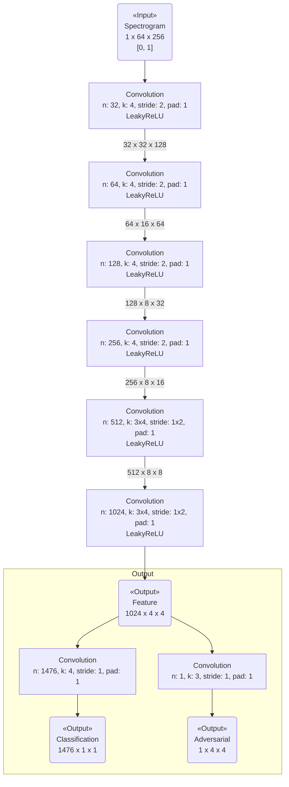

では、VRAM 不足により、minibatch size を2のような小さい値[^1]にしなければ学習できない。

そこで、入力のスペクトログラムのサイズを時間方向に小さくすることによって、必要な VRAM の大きさを減らすことができるのではないかと考えた。

特に、では1枚のスペクトログラムで約4秒分の音声を表していた。これは声質変換目的では過剰だと考えられる。

今回は、スペクトログラムの時間方向のサイズを1/4に削減して[^2]実験する。

## 入力データ ##

とほぼ同じ。
ただし、スペクトログラムについては、連続した17152サンプルを抽出する。これによって、1024x64 のデータが得られる。FFTを掛けた後、この左から1つ開けて1/4を使用するため、最終的に 256x64 のデータになる。

## モデル ##

### Discriminator のモデル ###

{:title="Discriminator Model" data-style="details"}

### Generator のモデル ###

```mermaid
graph TD

subgraph Input
    input-spectrogram("&laquo;Input&raquo;<br/>Spectrogram<br/>1 x 64 x 256<br/>[0, 1]")
    input-labels("&laquo;Input&raquo;<br/>Labels<sub>input</sub><br/>1479<br/>{0, 1}")
end

subgraph Downsampling
    downsamp1[Convoluton<br/>n: 32, k: 7, stride: 1, pad: 3<br/>BatchNormalization<br/>ReLU]
    downsamp2[Convoluton<br/>n: 64, k: 4, stride: 2, pad: 1<br/>BatchNormalization<br/>ReLU]
    downsamp3[Convoluton<br/>n: 128, k: 4, stride: 2, pad: 1<br/>BatchNormalization<br/>ReLU]
    downsamp4[Convoluton<br/>n: 256, k: 4, stride: 2, pad: 1<br/>BatchNormalization<br/>ReLU]
end

repeat((repeat<br/>8 x 32))
concat((concat))
merge[Convolution<br/>n: 256, k: 3, stride: 1, pad: 1<br/>BatchNormalization<br/>ReLU]

subgraph Bottleneck
    bottleneck1[ResBlock<br/>n: 256, k: 3, stride: 1, pad: 1<br/>BatchNormalization<br/>ReLU]
    bottleneck2[ResBlock<br/>n: 256, k: 3, stride: 1, pad: 1<br/>BatchNormalization<br/>ReLU]
    bottleneck3[ResBlock<br/>n: 256, k: 3, stride: 1, pad: 1<br/>BatchNormalization<br/>ReLU]
    bottleneck4[ResBlock<br/>n: 256, k: 3, stride: 1, pad: 1<br/>BatchNormalization<br/>ReLU]
    bottleneck5[ResBlock<br/>n: 256, k: 3, stride: 1, pad: 1<br/>BatchNormalization<br/>ReLU]
    bottleneck6[ResBlock<br/>n: 256, k: 3, stride: 1, pad: 1<br/>BatchNormalization<br/>ReLU]
end

subgraph Upsampling
    upsamp1[Deconvolution<br/>n: 128, k: 4, stride: 2, pad: 1<br/>BatchNormalization<br/>ReLU]
    upsamp2[Deconvolution<br/>n: 64, k: 4, stride: 2, pad: 1<br/>BatchNormalization<br/>ReLU]
    upsamp3[Deconvolution<br/>n: 32, k: 4, stride: 2, pad: 1<br/>BatchNormalization<br/>ReLU]
    upsamp4[Deconvolution<br/>n: 1, k: 7, stride: 1, pad: 3<br/>sigmoid]
end

output("&laquo;Output&raquo;<br/>Spectrogram<br/>1 x 64 x 256<br/>(0, 1)")

input-spectrogram --> downsamp1
downsamp1 --> | 32 x 64 x 256 | downsamp2
downsamp2 --> | 64 x 32 x 128 | downsamp3
downsamp3 --> | 128 x 16 x 64 | downsamp4
downsamp4 --> | 256 x 8 x 32 | concat

input-labels --> repeat
repeat --> | 1479 x 8 x 32 | concat
concat --> | 1607 x 8 x 32 | merge

merge --> | 256 x 8 x 32 | bottleneck1
bottleneck1 --> | 256 x 8 x 32 | bottleneck2
bottleneck2 --> | 256 x 8 x 32 | bottleneck3
bottleneck3 --> | 256 x 8 x 32 | bottleneck4
bottleneck4 --> | 256 x 8 x 32 | bottleneck5
bottleneck5 --> | 256 x 8 x 32 | bottleneck6

bottleneck6 --> | 256 x 8 x 32 | upsamp1
upsamp1 --> | 128 x 16 x 64 | upsamp2
upsamp2 --> | 64 x 32 x 128 | upsamp3
upsamp3 --> | 32 x 64 x 256 | upsamp4
upsamp4 --> output
```

{:title="Generator Model" data-style="details"}

## 学習 ##

と同じ。

## 学習パラメータ ##

*   optimizer: RMSprop

*   learning rate: 1e-5

    *   減衰: 100 epoch 毎に 10-0.5 倍。

*   minibatch size: 2

*   epoch: 1000

# 脚注 #

[^1]: minibatch size=2 は、Batch Normalization が有効な最小の値。

[^2]: これにより、1枚のスペクトログラムで約1秒の音声を表すことになる。
