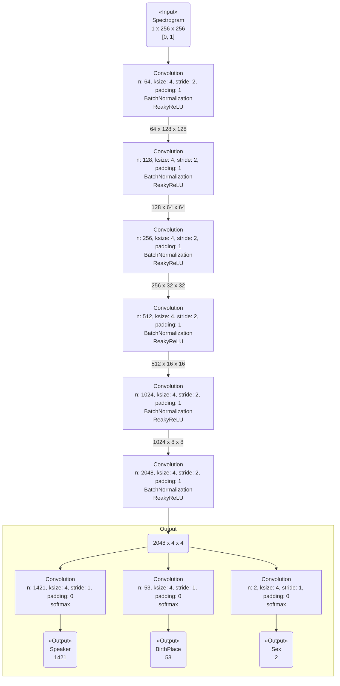

StarGAN (Conditional GAN) の実装にあたって、Discriminator にクラス分類できるだけの表現力があることを予め示したい。

[以前の実験]({{ '/experiments/54314b33.html' | absolute_url }})での話者分類精度の低さはある程度[改善された]({{ '/experiments/7a184ccb.html' | absolute_url }})が、もう少し精度を上げたい。

今回は、[StarGAN 論文](http://arxiv.org/abs/1711.09020)での Discriminator 実装に準拠した classifier を実験する。

## モデル ##

{:title="Classifier Model" data-style="details"}

## 学習パラメータ ##

optimizer: RMSprop

learning rate: 1e-5

minibatch size: 10

epoch: 1000

## 結果 ##

学習時間: 16.10 時間

## 感想 ##

話者を十分識別できるだけの表現空間があるといいっていいと考える。

出身地の識別が（話者と関連性があるにも関わらず）あまりうまくいっていない点が不可解。
